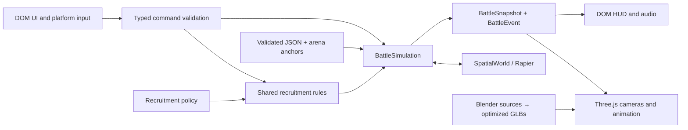

# Stick War 3D

Browser-first TypeScript / Three.js / Rapier rewrite. Reference master: 1f1883191a8c644b8d5981d785093a229efc650c; reference character branch: f01ffd2. Historical RON is retained beside this document. Old code and the character editor remain available in Git history.

Simulation is independent of presentation. Commands are processed while paused; only running sessions advance the 60 Hz clock. Three.js consumes snapshots and events. Rapier supplies spatial queries and kinematic collision movement. Both teams use the same rules.

Intentional corrections: passive income for both teams, immediate free/instant sandbox placement, projectile first-time-of-impact selection, deterministic simultaneous-destruction draw.

Assets are authored in Blender 5 and exported to GLB, with a shared humanoid rig, in-place animation and explicit attachment sockets. Source files, scripts and runtime exports are committed. No bespoke character editor.

## Milestones
1. Complete headless rules and simple-model playable game, desktop and landscape touch.
2. Blender characters, first-person models, ridge scene, animation and sound.
3. Browser QA, asset/bundle validation and Pages CI.

## Reference art
The concept studies were generated using built-in image generation during design. They express art direction, not measured game output. Production detail is constrained by the browser budgets.

Camera prompt: two views of the same narrow linear grassy limestone battlefield, elevated side-on command view and eye-level first-person swordsman view; matching blue/red bases, guardian statues, miners, swordsmen and archers; sculpted painted-tabletop medieval humans, warm sunlight, blue and terracotta team accents, no dense HUD.

Character prompt: three-column MINER / SWORDSMAN / ARCHER sheet, each with full-body three-quarter and rear views; recognizable human faces, six-head proportions, practical pickaxe and sack / sword with empty off-hand / bow and quiver; common humanoid rig proportions, tactile cloth/leather/steel, interchangeable cobalt and terracotta team accents.

## Ownership and update flow

`GameApp` owns one battle session, a persistent renderer, input bindings and shared assets. Restart disposes the Rapier world, units, timers, attacks, projectiles and battle actors, then constructs a fresh session. GPU geometry and material templates are deliberately cached across battles; per-instance skeleton textures are disposed. Bounded death effects are removed on expiry or reset. Input listeners are installed once, rather than once per battle.

The fixed-step order is economy/training/recruitment, target acquisition, kinematic movement, attacks/projectile sweeps, aggregated damage/deaths/outcome. Commands are synchronous administrative operations between ticks; paused sandbox requests therefore work without advancing time. Input samples are applied before stepping; simulation runs at 60 Hz with at most six catch-up ticks per render. Snapshots interpolate previous/current positions. Background suspension clears held inputs and pauses instead of accumulating a large catch-up interval.

The simulation imports no Three.js or DOM modules. Rapier is behind `SpatialWorld`, making collision behavior replaceable without storing gameplay in a mesh. Entity IDs monotonically increase within each battle; the configured 64-bit seed is retained as a string and processed with BigInt. Damage is aggregated before outcomes, so simultaneous statue destruction produces a draw. Sandbox retains its scene and dead statues without opening results.

## Content contracts

Costs, training durations, health, speeds, combat timing, mining and AI values remain in `config/game.json`. Values are converted at 50 legacy distance units per metre; new capsule radius, four-column formations, camera and scenery are authored for 3D. Historical RON is the reference, not a runtime dependency.

A valid balance reload affects subsequent requests and current nontransactional movement/AI settings. Active training retains its paid price and remaining duration. Existing units retain current/max health; newly spawned units receive the then-current definition. Windups retain their damage, range, melee cone and arrow parameters, and existing projectiles retain launch velocity, gravity, lifetime, radius and damage. Layout changes take effect on restart. Invalid JSON-schema values retain the last valid configuration and show a development message. Malformed JSON additionally invokes Vite's development overlay until corrected.

New units require a validated definition plus an appropriate focused behavior and asset binding. New arenas supply symmetric named anchors, corridor bounds and an `arena` GLB through the same asset manifest; combat systems do not change. Runtime expansion to selectable multiple arenas is a future UI feature; the content seam already exists.

## Controls and presentation

Possession changes camera/input ownership on the same unit. It cancels pending autonomous windups, preserves cooldowns, and excludes that unit from automatic targeting/movement/attacks. Pointer-lock loss, release and death return to the commander near the last controlled position. A failed lock request keeps drag-to-look and Space available. Touch pointers independently own movement, look and attack; dragging the attack button also changes aim. Training shortcuts are available only in commander mode.

Close characters use the detailed asset within 12 metres of the controlled unit; commander/distant characters use the lower-detail variant. Animation follows simulation phases, never decides damage. Desktop uses one restrained shadow-casting sun; touch mode omits dynamic shadows and limits pixel ratio. Menus, results and paused views render on invalidation only. Settings persist locally; reduced motion limits weapon movement and disables cosmetic corpses.

## Reference documentation

- [Three.js game architecture guidance](https://threejs.org/manual/en/game.html)
- [Rapier character controller](https://rapier.rs/docs/user_guides/javascript/character_controller/)
- [glTF Transform Meshopt optimization](https://gltf-transform.dev/modules/functions/functions/meshopt)
- [Blender glTF exporter](https://docs.blender.org/manual/en/latest/addons/import_export/scene_gltf2.html)
