# Production animation previews

Every GIF below is built from the exact normalized 384 x 384 frames shipped in
the corresponding runtime atlas. The red team is a deterministic recolor of the
same master frames, so timing, silhouette, contact, and release poses stay identical.

| Unit | Locomotion | Signature action | Combat response |
| --- | --- | --- | --- |
| Miner | 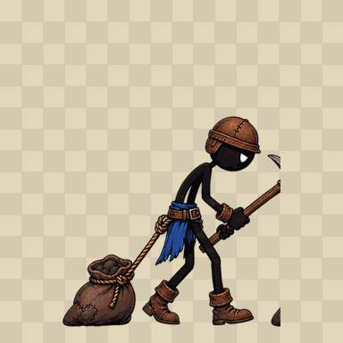 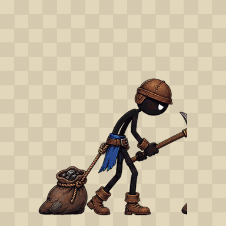 | 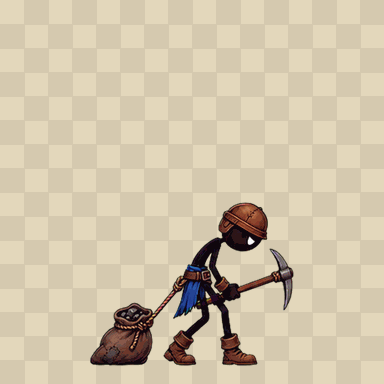 | 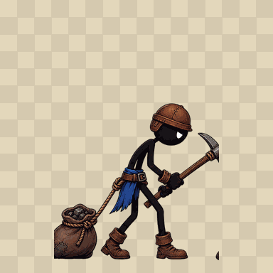 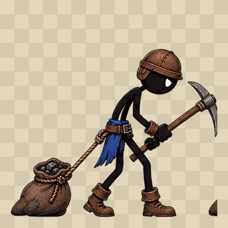 |
| Swordsman | 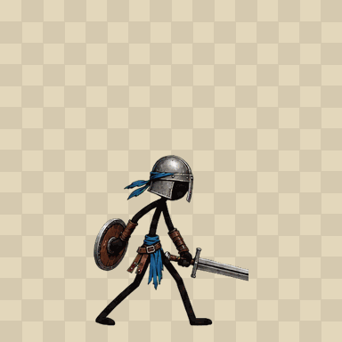 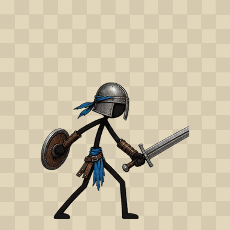 | 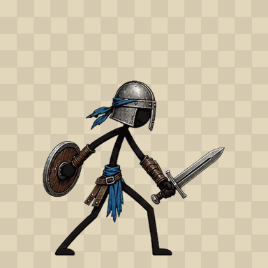 | 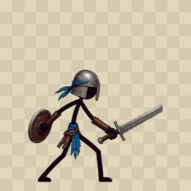 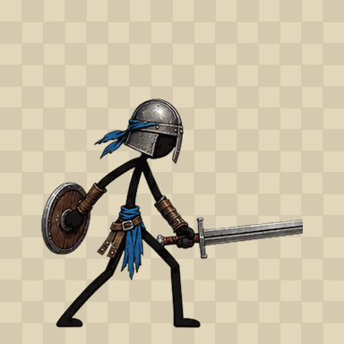 |
| Archer | 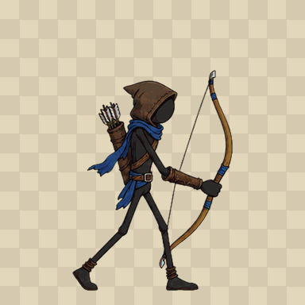 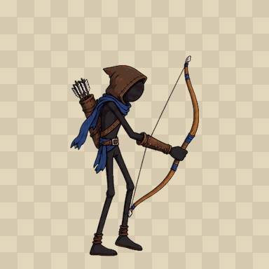 | 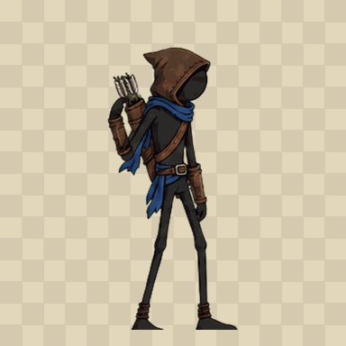 | 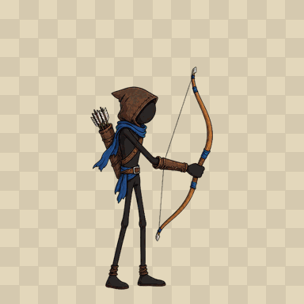 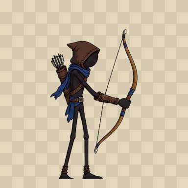 |

Idle loops are included in both team directories alongside the previews above.
